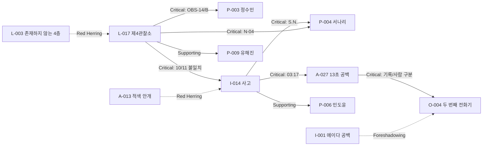

# Chapter 1 위키 연결 그래프

## 노드와 링크

| 출발 문서 | 도착 문서 | 역할 | 플레이어가 얻는 것 |
| --- | --- | --- | --- |
| L-017 | P-003 | Critical Clue | `OBS-14/B`의 원래 담당자는 정수민 |
| L-017 | I-014 | Critical Clue | 출입 10명/좌석 11개라는 첫 모순 |
| I-014 | P-004 | Critical Clue | `S.N.`과 서나리를 연결할 인물 파일 |
| L-017 | P-004 | Critical Clue | N-04·기록 보조라는 독립 증거 |
| I-014 | A-027 | Critical Clue | 03:17의 13초 공백을 조사할 이유 |
| A-027 | O-004 | Critical Clue | `R-14/ARCHIVE`와 기록/사람 구분 |
| I-014 | P-006 | Supporting Clue | 10명으로 저장된 최초 보고의 출처 |
| L-017 | P-009 | Supporting Clue | 10개 배지 원본 로그의 신뢰도 |
| A-013 | P-009 | Red Herring | 기억 공백 설명이 기각된 이유 |
| I-014 | A-013 | Red Herring | 그럴듯하지만 적용되지 않은 현상 |
| L-017 | L-003 | Red Herring | B석 코드와 4층을 혼동할 가능성 |
| L-003 | E-008 | Lore | 관찰과 존재 판단의 PMB 원칙 |
| I-001 | O-004 | Foreshadowing | 기록 시점이 현실을 앞서는 전조 |
| O-004 | I-014 | Foreshadowing | UNKNOWN이 사건의 기록을 알고 있음 |

## 흐름도

## 접근성 검토

- 첫 화면에서 L-017, I-014, O-004는 열려 있다. P-003은 L-017 링크로, P-004는 I-014 또는 L-017 중 어느 쪽으로도 접근한다.
- Puzzle 2에 필요한 사실은 세 문서 중 두 개를 먼저 보고 마지막 하나를 찾는 구조다. 서나리를 모르더라도 N-04 또는 S.N.으로 검색할 수 있다.
- Puzzle 3에 필요한 네 문서는 모두 Puzzle 2 완료 뒤 열리며, P-006/P-009은 정답 확신을 보강하지만 필수 병목은 아니다.
- A-013, L-003, E-008, I-001은 탐색의 폭과 불안을 주는 유효한 Dead End/Lore이며 정답을 바꾸지 않는다.

